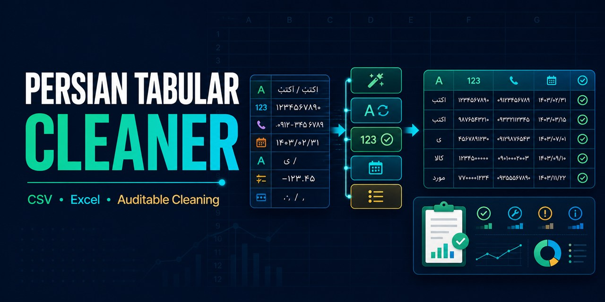

<p align="center">
  
</p>

# Persian Tabular Cleaner

[](https://github.com/Elenor274/persian-tabular-cleaner/actions/workflows/ci.yml)


Clean Persian CSV and Excel data without silently destroying invalid values. The package normalizes Persian text, digit scripts, Iranian mobile numbers, and Jalali dates while producing a machine-readable audit report.

> فایل‌های فارسی CSV و Excel را استاندارد کنید و دقیقاً ببینید چه سلول‌هایی تغییر کرده یا نامعتبر مانده‌اند.

## Why this project?

Real spreadsheets often mix Arabic and Persian characters, three digit scripts, inconsistent phone formats, Jalali dates, and invisible Unicode controls. Generic data cleaners do not understand these conventions. This tool applies only explicitly configured transformations and preserves values it cannot safely interpret.

## Features

- Arabic `ي/ك` to Persian `ی/ک` normalization
- Persian, Arabic, or English digit standardization
- Iranian mobile normalization to `+98...` or `09...`
- Jalali date conversion to Gregorian ISO dates
- CSV and Excel input/output
- Per-column change counts and invalid-value reporting
- Input DataFrames remain unchanged
- Synthetic tests, linting, coverage, CI, and no production data

## Install

```bash
git clone https://github.com/Elenor274/persian-tabular-cleaner.git
cd persian-tabular-cleaner
python -m venv .venv
source .venv/bin/activate  # Windows: .venv\Scripts\activate
pip install -e .
```

## Command line

```bash
persian-clean examples/sample_customers.csv cleaned.csv \
  --text-columns name,city \
  --phone-columns phone \
  --jalali-date-columns joined_at \
  --report cleaning-report.json
```

Example report:

```json
{
  "rows": 2,
  "columns": 4,
  "changed_cells": 7,
  "column_changes": {
    "name": 2,
    "city": 1,
    "phone": 2,
    "joined_at": 2
  },
  "invalid_values": {},
  "missing_columns": []
}
```

This report is produced by the synthetic file in `examples/`; actual values are always calculated from the input.

## Python API

```python
import pandas as pd

from persian_tabular_cleaner import CleanerConfig, clean_dataframe

data = pd.read_excel("customers.xlsx")
cleaned, report = clean_dataframe(
    data,
    CleanerConfig(
        text_columns=("name", "city"),
        phone_columns=("phone",),
        jalali_date_columns=("joined_at",),
    ),
)

cleaned.to_excel("customers-cleaned.xlsx", index=False)
print(report.to_dict())
```

## Safety model

- Only named columns are transformed.
- Missing configured columns are reported; strict mode can reject them.
- Invalid phone numbers and dates are retained and counted.
- Blank values remain blank.
- The input DataFrame is never mutated.

## Development

```bash
pip install -e ".[dev]"
ruff check .
ruff format --check .
python -m pytest --cov=persian_tabular_cleaner -q
```

## Scope

This project handles tabular data hygiene. It intentionally does not compete with full Persian NLP libraries such as Hazm, PersianTools, or ParsiKit.

## License

Released under the [MIT License](LICENSE).
